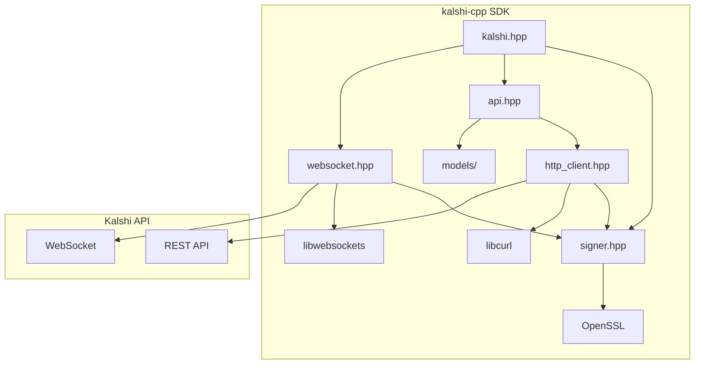
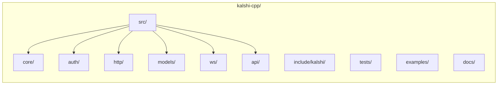

# Kalshi C++ SDK

A modern C++23 client library for the [Kalshi](https://kalshi.com) prediction market API.

## Upstream SDK / spec discovery

These commands are useful for auditing published SDK artifacts and specs; see `docs/research.md` for findings and parity matrix.

```bash
# TypeScript SDK (npm) - Community, WebSocket-only
npm view kalshi name version repository homepage dist.tarball
npm pack kalshi@0.0.5
# then: tar -xzf kalshi-0.0.5.tgz

# Python SDK sync (PyPI) - Official
pip download --no-deps kalshi-python
# or specific version: pip download --no-deps kalshi-python==2.1.4

# Python SDK async (PyPI) - Official  
pip download --no-deps kalshi-python-async
# or specific version: pip download --no-deps kalshi-python-async==3.2.0
```

## Features

- **RSA-PSS Authentication** - Secure API signing compatible with Kalshi's auth scheme
- **Modern C++23** - Uses `std::expected`, concepts, and other modern features
- **Clean Architecture** - Modular design with separate auth, HTTP, and model layers
- **Full REST API** - Typed methods for all Kalshi v2 endpoints
- **WebSocket Streaming** - Real-time orderbook, trade, fill, and lifecycle events
- **CMake + Make** - Easy build system with convenient Makefile wrappers

## Architecture



## Directory Structure



| Directory | Purpose |
| --------- | ------- |
| `src/` | Implementation files |
| `src/api/` | REST API client implementation |
| `src/ws/` | WebSocket client implementation |
| `include/kalshi/` | Public headers |
| `tests/` | Unit tests |
| `examples/` | Usage examples |
| `docs/` | Documentation and research |

## Quick Start

### Prerequisites

- C++23 compatible compiler (GCC 13+, Clang 16+)
- CMake 3.20+
- OpenSSL development libraries
- libcurl development libraries
- libwebsockets development libraries

### Build

```bash
# Clone the repository
git clone https://github.com/your-org/kalshi-cpp.git
cd kalshi-cpp

# Build
make build

# Run tests
make test

# Run benchmark (254 iterations by default)
make bench

# Check formatting
make lint
```

### Usage

#### REST API

```cpp
#include <kalshi/kalshi.hpp>

int main() {
    // Create signer with your API key
    auto signer = kalshi::Signer::from_pem_file("your-key-id", "path/to/key.pem");
    if (!signer) {
        std::cerr << "Failed: " << signer.error().message << "\n";
        return 1;
    }

    // Create HTTP client and API client
    kalshi::HttpClient http(std::move(*signer));
    kalshi::KalshiClient client(std::move(http));

    // Get markets
    auto markets = client.get_markets();
    if (markets) {
        for (const auto& m : markets->items) {
            std::cout << m.ticker << ": " << m.title << "\n";
        }
    }

    // Get account balance
    auto balance = client.get_balance();
    if (balance) {
        std::cout << "Balance: $" << balance->balance / 100.0 << "\n";
    }

    // Create an order
    kalshi::CreateOrderParams order;
    order.ticker = "MARKET-TICKER";
    order.side = kalshi::Side::Yes;
    order.action = kalshi::Action::Buy;
    order.type = "limit";
    order.count = 10;
    order.yes_price = 50;  // 50 cents
    
    auto result = client.create_order(order);
    if (result) {
        std::cout << "Order created: " << result->order_id << "\n";
    }

    return 0;
}
```

#### WebSocket Streaming

```cpp
#include <kalshi/kalshi.hpp>

int main() {
    auto signer = kalshi::Signer::from_pem_file("your-key-id", "path/to/key.pem");
    if (!signer) return 1;

    // Create WebSocket client
    kalshi::WebSocketClient ws(*signer);

    // Set up callbacks
    ws.on_message([](const kalshi::WsMessage& msg) {
        std::visit([](auto&& m) {
            using T = std::decay_t<decltype(m)>;
            if constexpr (std::is_same_v<T, kalshi::OrderbookDelta>) {
                std::cout << "Delta: " << m.market_ticker 
                          << " " << m.price << " " << m.delta << "\n";
            }
        }, msg);
    });

    ws.on_state_change([](bool connected) {
        std::cout << (connected ? "Connected" : "Disconnected") << "\n";
    });

    // Connect and subscribe
    if (ws.connect()) {
        auto sub = ws.subscribe_orderbook({"MARKET-TICKER"});
        // ... run event loop ...
    }

    return 0;
}
```

## Build Targets

| Target | Description |
| ------ | ----------- |
| `kalshi` | Main SDK interface library |
| `kalshi_core` | Core utilities, rate limiting, retry logic |
| `kalshi_auth` | RSA-PSS authentication |
| `kalshi_http` | HTTP client with signing |
| `kalshi_api` | REST API client with typed methods |
| `kalshi_ws` | WebSocket streaming client |
| `kalshi_models` | Data models |
| `kalshi_tests` | Test executable |

## API Coverage

### Exchange API

- `get_exchange_status()` - Get exchange status
- `get_exchange_schedule()` - Get trading schedule
- `get_exchange_announcements()` - Get announcements

### Markets API

- `get_market(ticker)` - Get single market
- `get_markets(params)` - List markets with filters
- `get_market_orderbook(ticker)` - Get order book
- `get_market_candlesticks(params)` - Get price history
- `get_trades(params)` - Get public trades

### Events & Series API

- `get_event(ticker)` - Get single event
- `get_events(params)` - List events
- `get_event_metadata(ticker)` - Get event metadata
- `get_series(ticker)` - Get series
- `get_series_list(params)` - List all series

### Portfolio API

- `get_balance()` - Get account balance
- `get_positions(params)` - Get positions
- `get_orders(params)` - List orders
- `get_order(id)` - Get single order
- `get_fills(params)` - Get fills
- `get_settlements(params)` - Get settlements

### Order Management

- `create_order(params)` - Create order
- `cancel_order(id)` - Cancel order
- `amend_order(params)` - Amend order
- `decrease_order(params)` - Decrease order size
- `batch_create_orders(request)` - Batch create
- `batch_cancel_orders(request)` - Batch cancel

### Order Groups

- `create_order_group(params)` - Create order group
- `get_order_groups(params)` - List order groups
- `get_order_group(id)` - Get single group
- `delete_order_group(id)` - Delete group
- `reset_order_group(id)` - Reset group

### Order Queue Position

- `get_order_queue_position(id)` - Get queue position
- `get_queue_positions(ids)` - Batch queue positions

### RFQ/Quotes

- `create_rfq(params)` - Create RFQ
- `get_rfqs(params)` - List RFQs
- `get_rfq(id)` - Get single RFQ
- `create_quote(params)` - Create quote
- `get_quotes(params)` - List quotes
- `get_quote(id)` - Get single quote
- `accept_quote(id)` - Accept quote

### Administrative

- `get_api_keys()` - List API keys
- `create_api_key(params)` - Create API key
- `delete_api_key(id)` - Delete API key
- `get_milestones(params)` - List milestones
- `get_milestone(id)` - Get milestone
- `get_multivariate_collections(params)` - List collections
- `get_multivariate_collection(id)` - Get collection
- `get_structured_targets(params)` - List targets
- `get_structured_target(id)` - Get target
- `get_communication(id)` - Get communication

### Search & Live Data

- `search_events(params)` - Search events
- `search_markets(params)` - Search markets
- `get_live_data(ticker)` - Get live data
- `get_live_datas(tickers)` - Batch live data
- `get_incentive_programs()` - List incentive programs

### WebSocket Channels

- `subscribe_orderbook(tickers)` - Order book deltas
- `subscribe_trades(tickers)` - Trade events
- `subscribe_fills(tickers)` - Fill notifications
- `subscribe_lifecycle()` - Market lifecycle events

## Documentation

- [Research Notes](docs/research.md) - Analysis of official SDKs, API behavior, and parity matrix
- [API Reference](docs/) - (Coming soon)

## License

See [LICENSE](LICENSE) for details.

## References

- [Kalshi API Documentation](https://docs.kalshi.com)
- [Python SDK (sync)](https://pypi.org/project/kalshi-python/) (PyPI) - v2.1.4 (official)
- [Python SDK (async)](https://pypi.org/project/kalshi-python-async/) (PyPI) - v3.2.0+ (official)
- [TypeScript SDK](https://www.npmjs.com/package/kalshi) (npm) - v0.0.5 (community, WebSocket-only)
