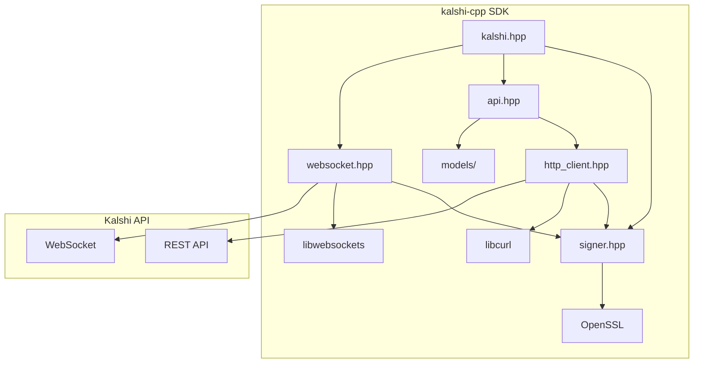
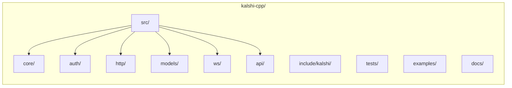

# Kalshi C++ SDK

[](https://github.com/Reddimus/kalshi-cpp/actions/workflows/ci.yml)
[](https://github.com/Reddimus/kalshi-cpp/releases)
[](https://en.cppreference.com/w/cpp/23)
[](https://opensource.org/licenses/MIT)

A modern C++23 client library for the [Kalshi](https://kalshi.com) prediction
market API. It gives you typed methods for the full Kalshi v2 REST surface plus
real-time WebSocket streaming, with RSA-PSS request signing built in. Errors are
returned as `std::expected<T, Error>` — no exceptions on the hot path — and the
library drops into any CMake project via `FetchContent` pinned to a release tag.

## Features

- **RSA-PSS authentication** — secure API signing compatible with Kalshi's auth
  scheme (SHA-256, PSS padding).
- **Modern C++23** — `std::expected<T, Error>` for every return (no exceptions),
  plus concepts and other modern features.
- **Full REST API** — typed methods for all Kalshi v2 endpoints (markets,
  portfolio, orders, RFQ/quotes, subaccounts, and more).
- **WebSocket streaming** — real-time orderbook, trade, fill, and lifecycle
  events with full depth parsing.
- **Clean, layered architecture** — modular static libs (core → auth → http →
  models → ws → api) behind one `kalshi::kalshi` interface target.
- **Fast JSON** — [Glaze](https://github.com/stephenberry/glaze) for the write
  path; hand-rolled scanners for the read hot path.
- **CMake + Make** — easy build system with convenient `Makefile` wrappers and a
  drop-in `FetchContent` / `find_package` integration.

## Quick start

The primary way to consume kalshi-cpp is **CMake `FetchContent` pinned to a
release tag** — that is how the downstream services consume it, and it needs no
system install of the SDK itself.

### 1. Add it to your CMake project

```cmake
include(FetchContent)
FetchContent_Declare(
    kalshi
    GIT_REPOSITORY https://github.com/Reddimus/kalshi-cpp.git
    GIT_TAG v0.4.8  # pin a tagged release; bump per "Versioning" below
)
# Consumers don't need the SDK's own tests or example binaries:
set(KALSHI_BUILD_TESTS OFF CACHE BOOL "" FORCE)
set(KALSHI_BUILD_EXAMPLES OFF CACHE BOOL "" FORCE)
FetchContent_MakeAvailable(kalshi)

target_link_libraries(myapp PRIVATE kalshi::kalshi)
```

You still need a few system libraries on the build host (OpenSSL, libcurl,
libwebsockets) — they are resolved with `find_package`/`pkg-config`, not vendored.
See [Prerequisites](#prerequisites) for the one-line install.

### 2. Get API credentials

1. Go to [Kalshi API settings](https://kalshi.com/settings/api).
2. Generate an API key pair and download the private key PEM file.
3. Note the **key ID** shown on the page.

The examples read them from `KALSHI_API_KEY_ID` and `KALSHI_API_KEY_FILE`.

### 3. Make your first authenticated call

A minimal, read-only program that authenticates and lists markets:

```cpp
#include <kalshi/kalshi.hpp>
#include <iostream>

int main() {
    auto signer = kalshi::Signer::from_pem_file("your-key-id", "path/to/key.pem");
    if (!signer) {
        std::cerr << "auth setup failed: " << signer.error().message << "\n";
        return 1;
    }
    kalshi::KalshiClient client(kalshi::HttpClient(std::move(*signer)));

    auto markets = client.get_markets();
    if (!markets) {
        std::cerr << "request failed: " << markets.error().message << "\n";
        return 1;
    }
    for (const auto& m : markets->items) {
        std::cout << m.ticker << ": " << m.title << "\n";
    }
    return 0;
}
```

That's the whole loop: create a signer from your PEM, wrap it in a client, call a
typed method, and check the `std::expected`. See [Usage](#usage) for order
placement and WebSocket streaming, or the runnable programs in
[`examples/`](examples/README.md) (`basic_usage.cpp`, `get_markets.cpp`,
`get_daily_temp.cpp`).

## Versioning & staying up to date

kalshi-cpp follows [Semantic Versioning](https://semver.org/spec/v2.0.0.html)
(`MAJOR.MINOR.PATCH`). While the package is pre-1.0 (`0.y.z`), a **minor** bump
(`0.4 → 0.5`) may carry breaking changes — review the
[CHANGELOG](CHANGELOG.md) before bumping the minor.

- **Discover a new release** — releases appear on the
  [Releases page](https://github.com/Reddimus/kalshi-cpp/releases) (the Release
  badge above links there). They are auto-published from a `vX.Y.Z` tag push, and
  the release body is the matching [CHANGELOG.md](CHANGELOG.md) section
  ([Keep a Changelog](https://keepachangelog.com/en/1.1.0/) format).
- **Understand what changed** — read [CHANGELOG.md](CHANGELOG.md), the
  authoritative change log.
- **Bump your pin** — pick the new tag, edit `GIT_TAG vX.Y.Z` in your
  `FetchContent_Declare`, then re-configure. `FetchContent` caches the resolved
  tag, so re-run `cmake` (or clear `build/_deps`) to actually move.
- **Verify at compile time** — `include/kalshi/version.hpp` is generated by
  CMake `configure_file()` from `project(kalshi-cpp VERSION ...)` (the single
  source of truth), so `kalshi::VERSION` can never drift from the tag you pin.
  Guard it if you depend on a minimum:

  ```cpp
  #include <kalshi/version.hpp>
  static_assert(kalshi::VERSION_MAJOR == 0 && kalshi::VERSION_MINOR >= 4,
                "kalshi-cpp: expected >= 0.4.x — check your FetchContent GIT_TAG");
  ```

  The release workflow refuses to publish unless the pushed `vX.Y.Z` tag equals
  `PROJECT_VERSION`, so a tag and its embedded `kalshi::VERSION` are always
  consistent.

## Usage

### REST API

```cpp
#include <kalshi/kalshi.hpp>

int main() {
    // Create signer with your API key
    auto signer = kalshi::Signer::from_pem_file("your-key-id", "path/to/key.pem");
    if (!signer) {
        std::cerr << "Failed: " << signer.error().message << "\n";
        return 1;
    }

    // Create HTTP client and API client
    kalshi::HttpClient http(std::move(*signer));
    kalshi::KalshiClient client(std::move(http));

    // Get markets
    auto markets = client.get_markets();
    if (markets) {
        for (const auto& m : markets->items) {
            std::cout << m.ticker << ": " << m.title << "\n";
        }
    }

    // Get account balance
    auto balance = client.get_balance();
    if (balance) {
        std::cout << "Balance: $" << balance->balance / 100.0 << "\n";
    }

    // Create an order
    kalshi::CreateOrderParams order;
    order.ticker = "MARKET-TICKER";
    order.side = kalshi::Side::Yes;
    order.action = kalshi::Action::Buy;
    order.type = "limit";
    order.count = 10;
    order.yes_price = 50;  // 50 cents

    auto result = client.create_order(order);
    if (result) {
        std::cout << "Order created: " << result->order_id << "\n";
    }

    return 0;
}
```

### WebSocket streaming

```cpp
#include <kalshi/kalshi.hpp>

int main() {
    auto signer = kalshi::Signer::from_pem_file("your-key-id", "path/to/key.pem");
    if (!signer) return 1;

    // Create WebSocket client
    kalshi::WebSocketClient ws(*signer);

    // Set up callbacks
    ws.on_message([](const kalshi::WsMessage& msg) {
        std::visit([](auto&& m) {
            using T = std::decay_t<decltype(m)>;
            if constexpr (std::is_same_v<T, kalshi::OrderbookDelta>) {
                std::cout << "Delta: " << m.market_ticker
                          << " " << m.price << " " << m.delta << "\n";
            }
        }, msg);
    });

    ws.on_state_change([](bool connected) {
        std::cout << (connected ? "Connected" : "Disconnected") << "\n";
    });

    // Connect and subscribe
    if (ws.connect()) {
        auto sub = ws.subscribe_orderbook({"MARKET-TICKER"});
        // ... run event loop ...
    }

    return 0;
}
```

See [examples/README.md](examples/README.md) for full live-streaming usage,
including the `get_daily_temp` example with `--stream`.

## Architecture


```mermaid
graph TD
    subgraph SDK["kalshi-cpp SDK"]
        A[kalshi.hpp] --> B[signer.hpp]
        A --> C[api.hpp]
        A --> D[websocket.hpp]
        C --> E[http_client.hpp]
        E --> B
        D --> B
        C --> F[models/]
        E --> G[libcurl]
        B --> H[OpenSSL]
        D --> I[libwebsockets]
    end

    subgraph API["Kalshi API"]
        J[REST API]
        K[WebSocket]
    end

    E --> J
    D --> K
```

The library is a stack of layered static libraries —
`kalshi_core` → `kalshi_auth` → `kalshi_http` → `kalshi_models` →
`kalshi_ws` → `kalshi_api` — exposed through a single `kalshi` INTERFACE
target. JSON is serialized with Glaze on the write path; the WebSocket-receive
and REST-response hot paths use hand-rolled string scanners for throughput and
v2-schema correctness.

### Directory structure


```mermaid
graph LR
    subgraph Root["kalshi-cpp/"]
        A[src/] --> A1[core/]
        A --> A2[auth/]
        A --> A3[http/]
        A --> A4[models/]
        A --> A5[ws/]
        A --> A6[api/]
        B[include/kalshi/]
        C[tests/]
        D[examples/]
        E[docs/]
    end
```

| Directory | Purpose |
| --------- | ------- |
| `src/` | Implementation files |
| `src/api/` | REST API client implementation |
| `src/ws/` | WebSocket client implementation |
| `include/kalshi/` | Public headers |
| `tests/` | Unit tests |
| `examples/` | Usage examples |
| `docs/` | Documentation and research |

## Building from source / development

You only need this section if you are **contributing to the SDK** or running its
tests/benchmarks locally. Consumers should use the
[Quick start](#quick-start) `FetchContent` path instead.

### Prerequisites

- C++23 compatible compiler (GCC 13+, Clang 16+)
- CMake 3.20+
- clang-format (required for `make lint`)
- OpenSSL, libcurl, and libwebsockets development libraries

Install the system dependencies:

```bash
# Debian / Ubuntu
sudo apt-get install -y build-essential cmake pkg-config clang-format \
    libssl-dev libcurl4-openssl-dev libwebsockets-dev

# macOS (Homebrew)
brew install cmake pkg-config openssl@3 curl libwebsockets clang-format
# If CMake can't find OpenSSL on macOS, point it at the brew prefix:
#   cmake -S . -B build -DOPENSSL_ROOT_DIR=$(brew --prefix openssl@3)
```

OpenSSL, libcurl, and libwebsockets are resolved via `find_package`/`pkg-config`
from the system (not vendored), so they must be present on the build host even
when you consume the SDK via `FetchContent`.

### Build

```bash
# Clone the repository
git clone https://github.com/Reddimus/kalshi-cpp.git
cd kalshi-cpp

# Build (Release with -O3 and LTO by default)
make build

# Run tests (GoogleTest, 160+ tests)
make test

# Generate code coverage report (requires lcov)
make coverage

# Run benchmark (254 iterations by default; override via BENCH_ITERATIONS=N)
make bench

# Check formatting
make lint
```

`make lint` is fail-fast: it exits non-zero if `clang-format` is missing or if
any source/header file violates formatting rules.

### Build options

The SDK supports several CMake options:

| Option | Default | Description |
| ------ | ------- | ----------- |
| `KALSHI_BUILD_TESTS` | ON | Build the GoogleTest suite (set OFF when consuming via FetchContent) |
| `KALSHI_BUILD_EXAMPLES` | ON | Build the example binaries (set OFF when consuming via FetchContent) |
| `KALSHI_ENABLE_LTO` | ON | Enable Link Time Optimization for Release builds |
| `KALSHI_NATIVE_ARCH` | OFF | Use `-march=native` for CPU-specific tuning (not portable) |
| `KALSHI_ENABLE_SANITIZERS` | OFF | Enable AddressSanitizer + UndefinedBehaviorSanitizer |
| `KALSHI_ENABLE_COVERAGE` | OFF | Enable code coverage instrumentation (gcov) |

Release builds automatically use `-O3 -DNDEBUG` and `-mtune=generic`.

```bash
# Build with native CPU optimizations (fastest, not portable)
cmake -S . -B build -DCMAKE_BUILD_TYPE=Release -DKALSHI_NATIVE_ARCH=ON
cmake --build build

# Build with sanitizers for debugging
cmake -S . -B build-san -DCMAKE_BUILD_TYPE=Debug -DKALSHI_ENABLE_SANITIZERS=ON
cmake --build build-san && ctest --test-dir build-san
```

### Install to a prefix + `find_package`

`FetchContent` (see [Quick start](#quick-start)) is recommended for almost all
consumers. Use `find_package` only when you install the SDK to a system prefix:

```bash
cmake -S . -B build -DCMAKE_BUILD_TYPE=Release
cmake --build build
cmake --install build --prefix /path/to/kalshi
```

In your consuming project:

```cmake
find_package(kalshi CONFIG REQUIRED)
target_link_libraries(myapp PRIVATE kalshi::kalshi)
```

Note: the installed `kalshiConfig.cmake` calls
`find_dependency(OpenSSL/CURL/PkgConfig)` and
`pkg_check_modules(libwebsockets REQUIRED)`, so the consuming machine needs
`pkg-config` and the libwebsockets `.pc` file available at `find_package` time
(not just when the SDK was built).

### Build targets

| Target | Description |
| ------ | ----------- |
| `kalshi` | Main SDK interface library |
| `kalshi_core` | Core utilities, rate limiting, retry logic |
| `kalshi_auth` | RSA-PSS authentication |
| `kalshi_http` | HTTP client with signing |
| `kalshi_api` | REST API client with typed methods |
| `kalshi_ws` | WebSocket streaming client |
| `kalshi_models` | Data models |
| `kalshi_tests` | Test executable (GoogleTest, 160+ tests) |
| `kalshi_parse_benchmark` | JSON parse-throughput regression guard (1000 iters; ctest-invoked) |

## API Coverage

### Exchange API

- `get_exchange_status()` - Get exchange status
- `get_exchange_schedule()` - Get trading schedule
- `get_exchange_announcements()` - Get announcements

### Markets API

- `get_market(ticker)` - Get single market
- `get_markets(params)` - List markets with filters
- `get_market_orderbook(ticker)` - Get order book
- `get_market_orderbooks(tickers)` - Get up to 100 order books in one request
- `get_market_candlesticks(params)` - Get historical OHLC data (requires series_ticker + ticker)
- `get_trades(params)` - Get public trades

### Events & Series API

- `get_event(ticker)` - Get single event
- `get_events(params)` - List events
- `get_event_metadata(ticker)` - Get event metadata
- `get_series(ticker)` - Get series
- `get_series_list(params)` - List all series

### Portfolio API

- `get_balance()` - Get account balance
- `get_positions(params)` - Get positions
- `get_orders(params)` - List orders
- `get_order(id)` - Get single order
- `get_fills(params)` - Get fills
- `get_settlements(params)` - Get settlements
- `get_deposits(params)` - List deposits (cursor-paginated)
- `get_withdrawals(params)` - List withdrawals (cursor-paginated)

### Subaccounts

- `create_subaccount()` - Create a new subaccount under the primary holder
- `transfer_subaccount(request)` - Move funds between two subaccounts
- `get_subaccount_balances()` - List balance per subaccount
- `get_subaccount_transfers(params)` - Paginated history of cross-subaccount transfers
- `update_subaccount_netting(subaccount, enabled)` - Toggle position netting on a subaccount
- `get_subaccount_netting()` - Read netting setting per subaccount

### Order Management

- `create_order(params)` - Create order
- `cancel_order(id)` - Cancel order
- `cancel_order_v2(params)` - Cancel event-market order with V2 result metadata
- `amend_order(params)` - Amend order
- `decrease_order(params)` - Decrease order size
- `batch_create_orders(request)` - Batch create
- `batch_cancel_orders(request)` - Batch cancel with current `orders`
  selectors; legacy `order_ids` callers are mapped to that body shape
- `batch_cancel_orders_v2(request)` - Batch cancel event-market orders with V2
  per-order results and errors
- `get_total_resting_order_value()` - Sum of all resting buy orders

### Order Groups

- `create_order_group(params)` - Create order group
- `get_order_groups(params)` - List order groups
- `get_order_group(id)` - Get single group
- `delete_order_group(id)` - Delete group
- `reset_order_group(id)` - Reset group

### Order Queue Position

- `get_order_queue_position(id)` - Get queue position
- `get_queue_positions(ids)` - Batch queue positions

### RFQ/Quotes

- `create_rfq(params)` - Create RFQ
- `get_rfqs(params)` - List RFQs
- `get_rfq(id)` - Get single RFQ
- `delete_rfq(id)` - Delete an RFQ
- `create_quote(params)` - Create quote
- `get_quotes(params)` - List quotes
- `get_quote(id)` - Get single quote
- `accept_quote(id)` - Accept quote
- `confirm_quote(id)` - Confirm quote
- `delete_quote(id)` - Delete quote

### Administrative

- `get_api_keys()` - List API keys
- `create_api_key(params)` - Create API key
- `generate_api_key(params)` - Generate an API key with specific scopes
- `delete_api_key(id)` - Delete API key
- `get_user_data_timestamp()` - Last-modified timestamp for the authenticated user
- `get_account_api_limits()` - Account API tier and read/write token buckets
- `get_endpoint_costs()` - Non-default endpoint token costs
- `get_milestones(params)` - List milestones
- `get_milestone(id)` - Get milestone
- `get_multivariate_collections(params)` - List collections
- `get_multivariate_collection(id)` - Get collection
- `get_structured_targets(params)` - List targets
- `get_structured_target(id)` - Get target
- `get_communication(id)` - Get communication

### Search & Live Data

- `search_events(params)` - Search events
- `search_markets(params)` - Search markets
- `get_live_data(ticker)` - Get live data
- `get_live_datas(tickers)` - Batch live data
- `get_incentive_programs()` - List incentive programs

### WebSocket Channels

- `subscribe_orderbook(tickers)` - Order book snapshots and deltas (full depth parsing)
- `subscribe_trades(tickers)` - Trade events with price and size
- `subscribe_fills(tickers)` - Fill notifications (user's orders)
- `subscribe_lifecycle()` - Market lifecycle events

### WebSocket Message Types

The SDK parses all WebSocket message types:

- **OrderbookSnapshot** - Full orderbook with yes/no arrays parsed
- **OrderbookDelta** - Price-level changes (supports negative deltas)
- **WsTrade** - Public trade with yes_price, count, taker_side
- **WsFill** - User fill with order details
- **MarketLifecycle** - Market open/close/settlement events

See [examples/README.md](examples/README.md) for live streaming usage.

## Documentation

- [Research Notes](docs/research.md) - Official-SDK analysis, the parity matrix,
  and the upstream artifact-audit (npm/PyPI) discovery commands
- [API Reference](docs/README.md) - Component overview with auth / REST / WS
  snippets, pagination, rate-limit, and retry behavior
- [Examples](examples/README.md) - Runnable usage examples, including WebSocket
  streaming
- [Changelog](CHANGELOG.md) - All notable changes (Keep a Changelog + SemVer)
- [Releases](https://github.com/Reddimus/kalshi-cpp/releases) - Published
  tagged releases

## Contributing

Issues and pull requests are welcome. For non-trivial changes please
open an issue first to discuss the approach. Local dev loop:

```bash
make build           # cmake -B build && cmake --build build
make test            # ctest --output-on-failure
make lint            # clang-format --dry-run -Werror
make format          # clang-format -i (call before pushing)
```

CI runs lint + build + test on Ubuntu 24.04 and build-only on macos-latest and
windows-latest, on push and PR; lint runs only on Linux (clang-format output
drifts between platform versions). See `.github/workflows/ci.yml`.

**Releasing**: bump `project(kalshi-cpp VERSION ...)` in `CMakeLists.txt`, add
the matching `## [X.Y.Z]` section to `CHANGELOG.md`, then push tag `vX.Y.Z` —
`.github/workflows/release.yml` verifies `tag == PROJECT_VERSION` and publishes
the release from the CHANGELOG section automatically.

## License

See [LICENSE](LICENSE) for details.

## References

- [Kalshi API Documentation](https://docs.kalshi.com)
- Official SDK packages, versions, and the full parity matrix:
  see [docs/research.md](docs/research.md) (kept as the single source of truth
  to avoid version drift).
