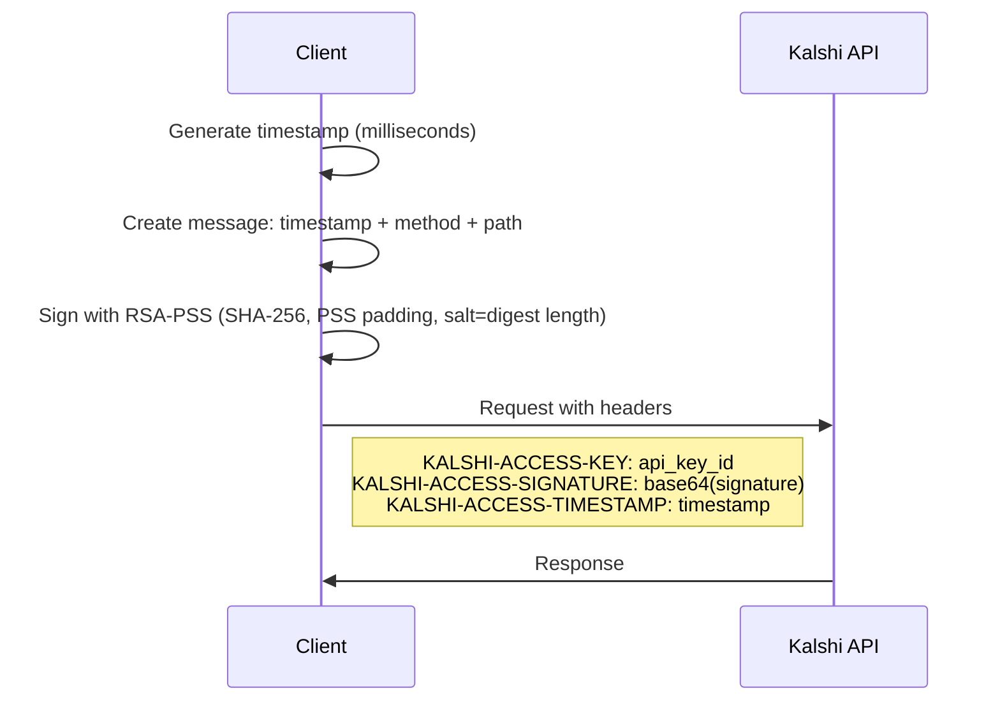

# Kalshi API Research

## Overview

This document summarizes findings from analyzing the official Kalshi SDK implementations (TypeScript npm package and Python PyPI packages) and their feature parity with this C++ SDK.

## SDK Versions Analyzed

| SDK | Package | Version | Maintainer | Status |
| --- | ------- | ------- | ---------- | ------ |
| **TypeScript** | [`kalshi`](https://www.npmjs.com/package/kalshi) on npm | 0.0.5 | Ashwin Mahadevan (community) | WebSocket-only |
| **Python Sync** | [`kalshi-python`](https://pypi.org/project/kalshi-python/) on PyPI | 2.1.4 | Kalshi (official) | Full REST API |
| **Python Async** | [`kalshi-python-async`](https://pypi.org/project/kalshi-python-async/) on PyPI | 3.2.0+ | Kalshi (official) | Full REST API (async) |

> **Note**: The prompt file mentioned `kalshi-typescript`, `kalshi_python_sync`, and `kalshi_python_async` as package names. After verification:
>
> - `kalshi-typescript` does not exist; the npm package is simply `kalshi`
> - `kalshi_python_sync` does not exist; the sync package is `kalshi-python`
> - `kalshi-python-async` is the correct async package name

### SDK Ownership

- **Python SDKs** (`kalshi-python`, `kalshi-python-async`): Official Kalshi packages. Author: `Kalshi Support <support@kalshi.com>`. Repository: `https://github.com/Kalshi/exchange-infra`. Auto-generated via OpenAPI Generator.
- **TypeScript SDK** (`kalshi`): Community package by Ashwin Mahadevan. WebSocket streaming only, no REST API.

## API Endpoints

### Production Endpoints

- **REST API**: `https://api.elections.kalshi.com/trade-api/v2/`
- **WebSocket**: `wss://api.elections.kalshi.com/trade-api/ws/v2`

### Legacy Endpoints (deprecated)

- `https://trading-api.kalshi.com/v1` (Python SDK v0.2.0)

## Authentication

### RSA-PSS Signing (TypeScript SDK - Current)

The TypeScript SDK uses RSA-PSS signatures for authentication:



#### Signature Algorithm Details

- **Algorithm**: RSA-PSS
- **Hash**: SHA-256
- **Padding**: RSA_PKCS1_PSS_PADDING
- **Salt Length**: RSA_PSS_SALTLEN_DIGEST (same as hash output, 32 bytes)
- **Message Format**: `{timestamp}{method}{path}` (no separators)
- **Timestamp**: Unix milliseconds as string
- **Output**: Base64-encoded signature

### Session-Based Auth (Python SDK - Legacy v1 API)

The Python SDK uses email/password login with session tokens:

1. POST to `/log_in` with email/password
2. Receive token in response
3. Use `Authorization: Basic {token}` header for subsequent requests

## WebSocket Channels

### Available Channels

1. `orderbook_delta` - Order book updates
2. `trade` - Trade executions
3. `fill` - User fill notifications
4. `market_lifecycle` - Market status changes

### Message Types

#### Subscribe Command

```json
{
  "id": 1,
  "cmd": "subscribe",
  "params": {
    "channels": ["orderbook_delta"],
    "market_tickers": ["TICKER-1", "TICKER-2"]
  }
}
```

#### Subscribed Response

```json
{
  "id": 1,
  "type": "subscribed",
  "msg": {
    "sid": 1,
    "channel": "orderbook_delta"
  }
}
```

#### Update Subscription Command

```json
{
  "id": 2,
  "cmd": "update_subscription",
  "params": {
    "action": "add_markets",
    "channel": "orderbook_delta",
    "market_tickers": ["TICKER-3"],
    "sids": [1]
  }
}
```

#### Unsubscribe Command

```json
{
  "id": 3,
  "cmd": "unsubscribe",
  "params": {
    "sids": [1]
  }
}
```

#### Orderbook Snapshot

```json
{
  "type": "orderbook_snapshot",
  "sid": 1,
  "seq": 1,
  "msg": {
    "market_ticker": "TICKER",
    "yes": [[50, 100], [51, 200]],
    "no": [[49, 150]]
  }
}
```

#### Orderbook Delta

```json
{
  "type": "orderbook_delta",
  "sid": 1,
  "seq": 2,
  "msg": {
    "market_ticker": "TICKER",
    "price": 50,
    "delta": -50,
    "side": "yes"
  }
}
```

#### Trade

```json
{
  "type": "trade",
  "sid": 1,
  "msg": {
    "trade_id": "uuid",
    "market_ticker": "TICKER",
    "yes_price": 50,
    "no_price": 50,
    "count": 10,
    "taker_side": "yes",
    "ts": 1234567890
  }
}
```

#### Fill

```json
{
  "type": "fill",
  "sid": 1,
  "msg": {
    "trade_id": "uuid",
    "order_id": "uuid",
    "market_ticker": "TICKER",
    "is_taker": true,
    "side": "yes",
    "yes_price": 50,
    "no_price": 50,
    "count": 10,
    "action": "buy",
    "ts": 1234567890
  }
}
```

#### Market Lifecycle

```json
{
  "type": "market_lifecycle",
  "sid": 1,
  "msg": {
    "market_ticker": "TICKER",
    "open_ts": 1234567890,
    "close_ts": 1234567890,
    "determination_ts": 1234567890,
    "settled_ts": 1234567890,
    "result": "yes",
    "is_deactivated": false
  }
}
```

## REST API Endpoints (v2)

Based on the Python SDK kalshi-python@2.1.4 analysis:

### Exchange API

- `GET /exchange/status` - Get exchange status
- `GET /exchange/schedule` - Get exchange schedule
- `GET /exchange/announcements` - Get announcements

### Markets API

- `GET /markets` - List markets (paginated)
- `GET /markets/{ticker}` - Get market details
- `GET /markets/{ticker}/orderbook` - Get order book
- `GET /markets/{ticker}/candlesticks` - Get candlestick data
- `GET /trades` - Get public trades (paginated)

### Events API

- `GET /events` - List events (paginated)
- `GET /events/{event_ticker}` - Get event details
- `GET /events/{event_ticker}/metadata` - Get event metadata

### Series API

- `GET /series` - List series
- `GET /series/{series_ticker}` - Get series details

### Portfolio API (Authenticated)

- `GET /portfolio/balance` - Get account balance
- `GET /portfolio/positions` - Get positions (paginated)
- `GET /portfolio/orders` - Get orders (paginated)
- `GET /portfolio/orders/{order_id}` - Get single order
- `GET /portfolio/fills` - Get fills (paginated)
- `GET /portfolio/settlements` - Get settlements (paginated)

### Order Management (Authenticated)

- `POST /portfolio/orders` - Create order
- `DELETE /portfolio/orders/{order_id}` - Cancel order
- `POST /portfolio/orders/{order_id}/amend` - Amend order
- `POST /portfolio/orders/{order_id}/decrease` - Decrease order
- `POST /portfolio/orders/batched` - Batch create orders
- `DELETE /portfolio/orders/batched` - Batch cancel orders

## Data Models

### Market

```typescript
interface Market {
  ticker: string;
  series_ticker?: string;
  event_ticker?: string;
  title: string;
  subtitle?: string;
  open_time: datetime;
  close_time: datetime;
  expiration_time?: datetime;
  status: "initialized" | "active" | "closed" | "settled" | "determined";
  yes_bid?: number;
  yes_ask?: number;
  no_bid?: number;
  no_ask?: number;
  last_price?: number;
  volume?: number;
  volume_24h?: number;
  result?: "yes" | "no" | "";
  can_close_early?: boolean;
  cap_count?: number;
}
```

### Order

```typescript
interface CreateOrderRequest {
  ticker: string;
  client_order_id?: string;
  side: "yes" | "no";
  action: "buy" | "sell";
  count: number;  // >= 1
  type: "limit" | "market";
  yes_price?: number;  // 1-99
  no_price?: number;   // 1-99
  expiration_ts?: number;
  sell_position_floor?: number;
  buy_max_cost?: number;
}
```

### Price

- Prices are in cents (1-99 range for binary markets)
- Integer type

### Order Book Entry

- Tuple: `[price_cents, quantity_contracts]`

### Side

- Enum: `"yes"` | `"no"`

### Action

- Enum: `"buy"` | `"sell"`

## Error Handling

### HTTP Error Response

```json
{
  "error": {
    "code": "error_code",
    "message": "Human-readable error message"
  }
}
```

### WebSocket Error Response

```json
{
  "id": 1,
  "type": "error",
  "msg": {
    "code": 400,
    "message": "Error description"
  }
}
```

## SDK Parity Matrix

This matrix compares feature coverage across official SDKs and this C++ implementation.

### Authentication Parity

| Feature | Python Sync | Python Async | TypeScript | C++ |
| ------- | ----------- | ------------ | ---------- | --- |
| RSA-PSS Signing | ✅ | ✅ | ✅ | ✅ |
| API Key Auth | ✅ | ✅ | ✅ | ✅ |

### REST API - Exchange

| Endpoint | Python Sync | Python Async | TypeScript | C++ |
| -------- | ----------- | ------------ | ---------- | --- |
| `GET /exchange/status` | ✅ | ✅ | ❌ | ✅ |
| `GET /exchange/schedule` | ✅ | ✅ | ❌ | ✅ |
| `GET /exchange/announcements` | ✅ | ✅ | ❌ | ✅ |
| `GET /exchange/user-data-timestamp` | ✅ | ✅ | ❌ | ✅ |

### REST API - Markets

| Endpoint | Python Sync | Python Async | TypeScript | C++ |
| -------- | ----------- | ------------ | ---------- | --- |
| `GET /markets` | ✅ | ✅ | ❌ | ✅ |
| `GET /markets/{ticker}` | ✅ | ✅ | ❌ | ✅ |
| `GET /markets/{ticker}/orderbook` | ✅ | ✅ | ❌ | ✅ |
| `GET /markets/{ticker}/candlesticks` | ✅ | ✅ | ❌ | ✅ |
| `GET /trades` | ✅ | ✅ | ❌ | ✅ |

### REST API - Events & Series

| Endpoint | Python Sync | Python Async | TypeScript | C++ |
| -------- | ----------- | ------------ | ---------- | --- |
| `GET /events` | ✅ | ✅ | ❌ | ✅ |
| `GET /events/{ticker}` | ✅ | ✅ | ❌ | ✅ |
| `GET /events/{ticker}/metadata` | ✅ | ✅ | ❌ | ✅ |
| `GET /series` | ✅ | ✅ | ❌ | ✅ |
| `GET /series/{ticker}` | ✅ | ✅ | ❌ | ✅ |

### REST API - Portfolio (Authenticated)

| Endpoint | Python Sync | Python Async | TypeScript | C++ |
| -------- | ----------- | ------------ | ---------- | --- |
| `GET /portfolio/balance` | ✅ | ✅ | ❌ | ✅ |
| `GET /portfolio/positions` | ✅ | ✅ | ❌ | ✅ |
| `GET /portfolio/orders` | ✅ | ✅ | ❌ | ✅ |
| `GET /portfolio/orders/{id}` | ✅ | ✅ | ❌ | ✅ |
| `GET /portfolio/fills` | ✅ | ✅ | ❌ | ✅ |
| `GET /portfolio/settlements` | ✅ | ✅ | ❌ | ✅ |
| `GET /portfolio/total-resting-order-value` | ✅ | ✅ | ❌ | ✅ |

### REST API - Order Management (Authenticated)

| Endpoint | Python Sync | Python Async | TypeScript | C++ |
| -------- | ----------- | ------------ | ---------- | --- |
| `POST /portfolio/orders` | ✅ | ✅ | ❌ | ✅ |
| `DELETE /portfolio/orders/{id}` | ✅ | ✅ | ❌ | ✅ |
| `POST /portfolio/orders/{id}/amend` | ✅ | ✅ | ❌ | ✅ |
| `POST /portfolio/orders/{id}/decrease` | ✅ | ✅ | ❌ | ✅ |
| `POST /portfolio/orders/batched` | ✅ | ✅ | ❌ | ✅ |
| `DELETE /portfolio/orders/batched` | ✅ | ✅ | ❌ | ✅ |

### REST API - Additional Features

| Endpoint | Python Sync | Python Async | TypeScript | C++ |
| -------- | ----------- | ------------ | ---------- | --- |
| Order Groups | ✅ | ✅ | ❌ | ✅ |
| Order Queue Position | ✅ | ✅ | ❌ | ✅ |
| RFQ/Quotes (full lifecycle) | ✅ | ✅ | ❌ | ✅ |
| API Keys Management (incl. generate) | ✅ | ✅ | ❌ | ✅ |
| Milestones | ✅ | ✅ | ❌ | ✅ |
| Multivariate Collections (incl. lookup) | ✅ | ✅ | ❌ | ✅ |
| Structured Targets | ✅ | ✅ | ❌ | ✅ |
| Communications | ✅ | ✅ | ❌ | ✅ |
| Search API | ❌ | ✅ | ❌ | ✅ |
| Live Data API | ❌ | ✅ | ❌ | ✅ |
| Incentive Programs | ❌ | ✅ | ❌ | ✅ |

### WebSocket Channels Parity

| Channel | Python Sync | Python Async | TypeScript | C++ |
| ------- | ----------- | ------------ | ---------- | --- |
| `orderbook_delta` | ❌ | ❌ | ✅ | ✅ |
| `trade` | ❌ | ❌ | ✅ | ✅ |
| `fill` | ❌ | ❌ | ✅ | ✅ |
| `market_lifecycle` | ❌ | ❌ | ✅ | ✅ |

### Summary

| Category | C++ Coverage |
| -------- | ------------ |
| **Authentication** | Full parity |
| **Markets API** | Full parity |
| **Events API** | Full parity |
| **Series API** | Full parity |
| **Portfolio API** | Full parity |
| **Order Management** | Full parity |
| **Exchange API** | Full parity |
| **WebSocket** | Full parity with TypeScript SDK |
| **Advanced Features** | Full parity |

The C++ SDK now provides **complete feature parity** with the official Kalshi Python SDKs, including all REST API endpoints for trading, portfolio management, order groups, RFQ/quotes, and administrative features.

## References

- TypeScript SDK: `kalshi@0.0.5` on npm (community, WebSocket-only)
- Python SDK (sync): `kalshi-python@2.1.4` on PyPI (official, OpenAPI-generated)
- Python SDK (async): `kalshi-python-async@3.2.0` on PyPI (official, OpenAPI-generated)
- API Documentation: <https://docs.kalshi.com>
- OpenAPI Generator: Python SDKs are auto-generated from OpenAPI spec
